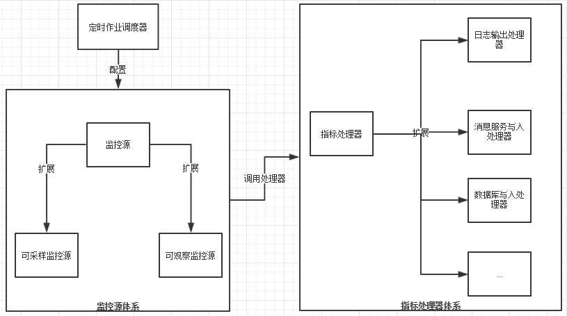

# 监控设计
监控体系组成：监控源、指标值、指标处理器

# 监控源体系
## 监控源定义(MonitorSource)
监控源底层是MonitorSource类。
内部定义了一个属性_monitorSourceName，表示该监控源名称，全局唯一。

## 扩展的监控源(extends MonitorSource)
* ###可采样监控源(SampleMonitorSource)
该类定义了一个采样接口sample,通过该接口的重写可实现监控源的采样。
* ###可观察的监控源(ObserableMonitorSource)
该类定义了一个触发函数notify,调用该函数可把监控指标值(MetricValue)发送到注册观察者(MonitorSourceObserver)中。

## 监控源注册器(MonitorSourceRegistry)
监控源定义完成后,需要注册到监控源注册表中才能使用
monitorSourceRegistry.registMonitorSource(monitorSource)

# 指标值
监控源定义了一个可监控实体(如，CPU)，而指标值则体现了监控源的数据实体(如CPU使用率，CPU空闲值等指标值)。
## 指标值定义(MetricValue)
* _clientId: 节点编号(与多节点应用有关)
* _monitorSourceName: 监控源名称
* _sampleTime: 采样时间戳
* _status: 状态码

## 扩展的监控指标值(extends MetricValue)
1. ### 单指标值(SingleMetricValue )
    监控实体仅仅由一个指标值可表示。
    * name:指标名称
    * value:指标值
2. ### 多指标值(MultiMetricValue)
    监控实体由多个指标值方可表示(如VirtualMemoryMonitorSource)。
    * _values:多指标值，Map类型，每一个entry表示指标(key:指标名称，value:指标值)
3. ### 多指标值数组(BatchMultiMetricValue)
    监控实体由多指标值数组方可表示(如多核CPU，每一个核CPU的数据实体都是MultiMetricValue)
    * _values:多指标值数组,每一个element表示多指标值。
4. #### 多指标值字典(KeyedMultiMetricValue)
    监控实体由多指标值字典方可表示。与数组不同，字典中的每个多指标值代表监控源不同的方面。
    * _values:多指标值Map，每一个entry表示指标(key:监控源某一功能名称，value:多指标值)

# 指标值处理器
## 指标值处理器定义(MetricProcessor)
指标值处理器代表了指标值的处理方式，可入库，写文件或触发其他操作。
MetricProcessor是处理器底层类，其他扩展的处理器都继承于该类。
* start()
* stop()
* fail()
* process(MetricValue):指标值处理接口，可覆盖实现。

## 扩展的指标值处理器
* ### 预警处理器(AlarmMetricProcessor)
    通过预设的条件触发警报，当指标值达到该条件时触发
    1. 百分比PercentlineMetricProcessor
    2. 计数CounterMetricProcessor
    3. 阈值ThresholdMetricProcessor
* ### 链处理器(ChainMetricProcessor)
通过添加多个处理器实现多处理器顺序处理
* ### Http报表推送(HTTPJsonExportMetricProcessor)
* ### InfluxDB写入(InfluxDBSenderMetricProcessor)
* ### 日志输出(LoggingMetricProcessor)
* ### 定时作业(ScheduleMetricProcessor)
* ### 发送至MQ服务器
    1. ZeroMQSenderMetricProcessor
    2. HornetQSenderMetricProcessor
    3. ActiveMQSenderMetricProcessor
* ### 其他有待添加

## 指标处理器注器MonitorProcessorRegistry
常用于注册定时任务，如定时采样，定时推送
monitorProcessorRegistry.registMonitorProcessor(name, metricProcessor)
* name:处理器名称，唯一
* metricProcessor:处理器
